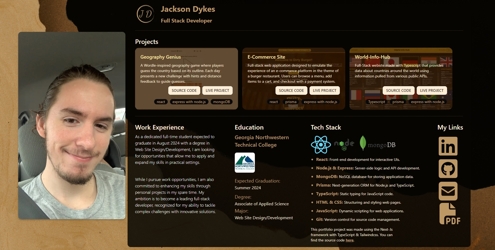

# Jackson Dykes Portfolio

## Full Stack Developer

Welcome to the repository of my personal portfolio, which showcases my projects, work experience, and the tech stack I'm proficient in. This portfolio is built using Next.js, TypeScript, and TailwindCSS.

### Features

- Responsive design showcasing projects with source code and live project links
- Overview of my technical skills, work experience, and educational background
- Direct links to my professional profiles and resume

### Projects Highlight

- **Geography Genius**: A Wordle-inspired geography game built with React, Express.js, and MongoDB.
- **E-Commerce Site**: A full-stack application simulating an e-commerce platform with React, Prisma, and Express.js.
- **World-Info-Hub**: A TypeScript-based site providing data on countries via public APIs.
